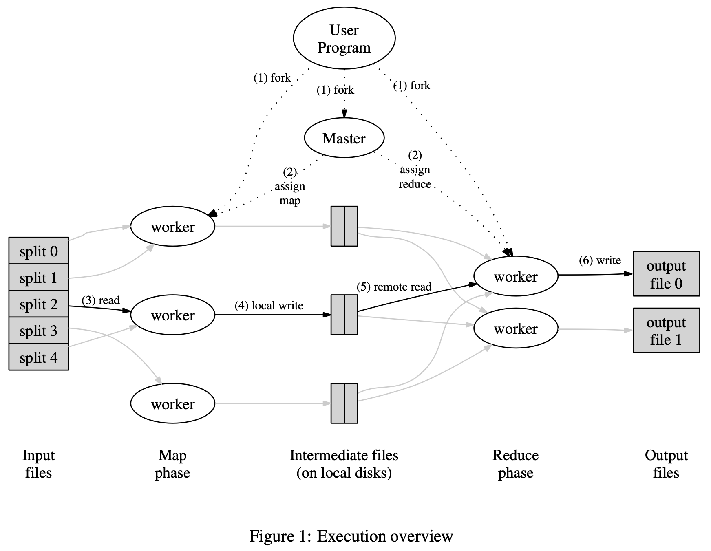

# MIT6.824 Lab1
> 用go语言实现一个简单的MapReduce系统，多个worker进程调用application的Map和Reduce function，
并负责中间文件和结果文件的读写，coordinator负责分配task给worker，并处理work的failuer问题。

## MapReduce框架结构

- master负责分配任务（map or reduce）给worker进程
- map worker从input files读取一个shard并进行处理，然后存储中间结果，中间结果会根据partition
function分割成R个region.
- reduce worker从各个map worker处读取其负责的中间结果文件，**需要进行一个sort，因为
往往一个reduce task会负责多个不同的key，进行sort来把相同的key-value进行group， 然后
进行reduce操作并写入结果文件。

### 针对failure问题的解决方案：rename
- map和reduce worker均生成temp file。
- map worker完成后，生成R个中间temp 文件，并把文件名传给coordinator，若coordinator没收到过
该map task的，则记录下来，否则忽略。
- reduce worker则根据coordinator提供的文件名进行读取，结果也写入temp file，完成后进行rename，
因此多个相同的reduce worker也只会产生一个output file。（output file位于GFS上，不是local disk）

### 针对straggler问题：
当一个map-reduce快要完成时，coordinator同时开启一些backup进程来完成剩下的工作，不论是backup还是
primary先完成，整个job都完成了。

---
## Lab1

