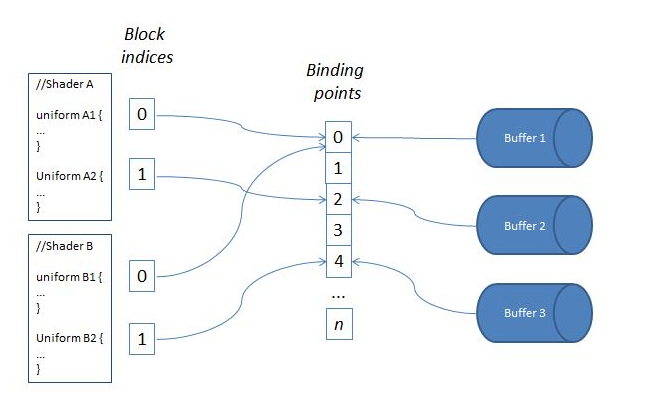

- glEGLImageTargetTexture2DOES
	- Desc
		- an OpenGL ES extension function
		- **allow an EGLImage to be used as the source of data for an OpenGL ES 2D texture**
		- allow app to use image data from sources outside the OpenGL ES context (video streams, OpenCL...)
	- Spec:


### glBindBuffer & glBindBufferBase
- glBindBuffer is used to bind a buffer to a specific target so that all operations which modify that target are mapped to that buffer afterwards
- glBindBufferBase is used for a totally different purpose.
	- it's used to bind a buffer to a specific binding point in an indexed array (when data is not supposed to be directly modified but rather used)
    - 
	- `glBindBufferBase` is creating the arrows on the right
	- get block index: `glGetUniformBLockIndex`
	- link to the binding point: `glUniformBlockBinding`
- indexed binding points
```
GLuint bufferIDs[2];
glGenBuffers(2, bufferIDs);

// Bind buffer object 1 to binding points 0
glBindBufferBase(GL_UNIFORM_BUFFER, 0, bufferIDs[0]);

// Bind buffer object 2 to binding points 1
glBindBufferBase(GL_UNIFORM_BUFFER, 1, bufferIDs[1]);

```

```
layout(std140, binding = 0) uniform MyBlock1 {
    // Uniform variables for block 1
};

layout(std140, binding = 1) uniform MyBlock2 {
    // Uniform variables for block 2
};

```
- binding = 0  <-->  bufferIDs\[0\]
- binding = 1   <-->  bufferIDs\[1\]
- we can change the binding points to switch between different sets of uniform data during rending, without the need to recompiling or relinking the shader program