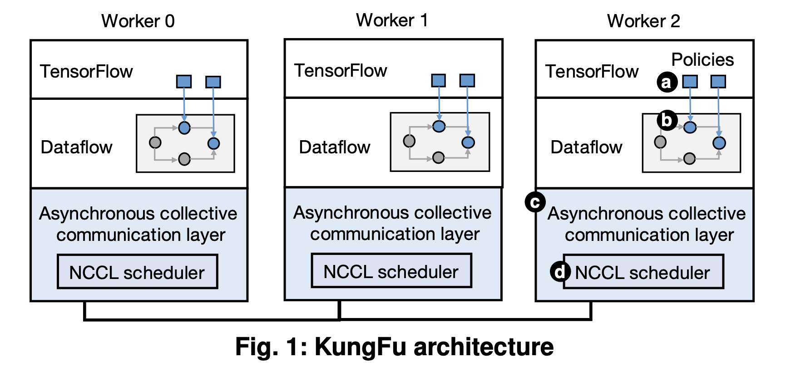
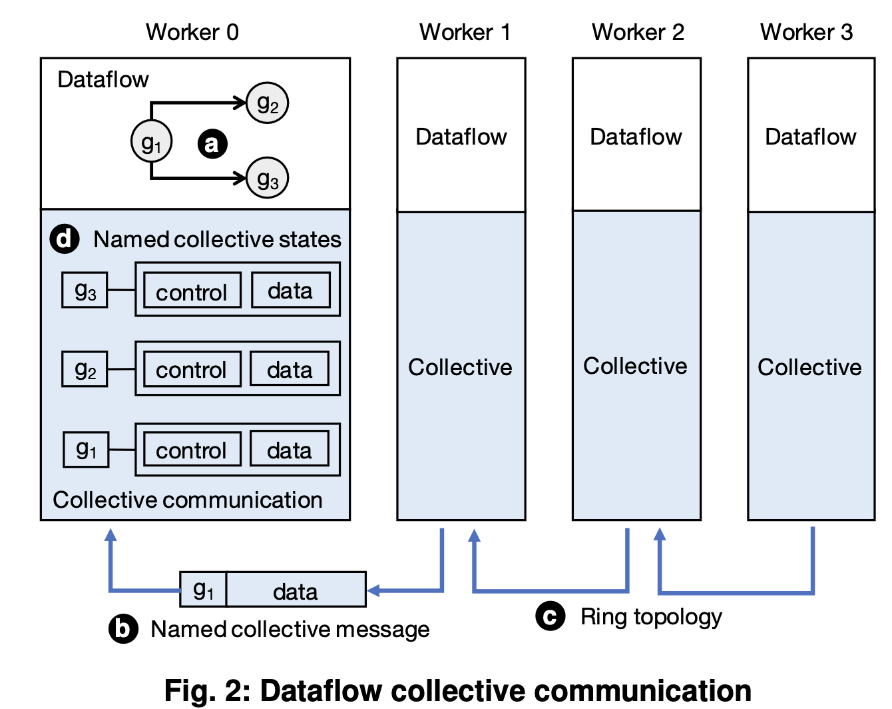

# KungFu: Making Training in Distributed Machine Learning Adaptive

> 一篇讲adaptive 分布式训练框架设计与实现的论文。在分布式训练中，影响训练的主要有超参（bs，lr）,
系统参数（worker 数量，通信拓扑）
这篇文章针对TensorFlow开发了一个分布式ML library。用户可以借此设计一些Adaptation Policy来描述
如何在训练过程中改变hyper和system 参数。
感觉更多是系统实现上的思考，如何monitor各种metric，以及如何完成相应的control operation。

## Adaption Policies
- 提供了一层软件抽象给用户，用户可以定制自己的policy。
关键点：framework-independent
举了一个例子：根据GNS（gradient noise sclae）来动态改变bs

## 最重要的两点：
- 如何进行低开销的metric monitoring
- 如何根据metric和policy在分布式环境下做出work stage的management

## Monitoring
主要是monitor worker的performance和gradient. 

- 对于一些需要实时梯度信息，比如GNS的policy，这个metric的计算需要所有worker的gradient信息，
Kungfu会把所这个monitor需求转化为monitor op(例如对梯度的再次处理）嵌入到data flow中，这样就可以直接使用到data flow
计算出的中间结果。实现了**低开销梯度信息采集**。

由于monitor metric需要全局的信息，所以需要collective communication，为了防止block training，
kungfu设计了一层 asynchronous collective communication。
### collective communication for dataflows

在参数更新这一环节，一些metric可以借此完成全局metric的计算，还有一些metric需要额外的collective
communication. Kungfu利用async来overlap。
另一个问题是，不同worker完成梯度的顺序不一样，async可能会导致inconsistency。**Horovod**采用了
一个中心式的coordinator，来track每个worker上的ready gradient

- **named collective messages**: 每一个named collective message携带两个信息：**data**--
具体的gradient data； **key**--指出gradient data的归属地。
- **named collective stages**: 每收到一个named collective message，worker识别出它的
key，然后提取出gradient data，放进states中的data buffer进行accumulate，state中的**control**
用来记录收集了多少了，下一个hop是哪个，如果收集满了就返回结果。

最后还讲了怎么优化了下NCCL，按下不表。

## 根据实时metric数据来调整worker的parameters
大部分的系统，configure parameter在编译的时候都确定了，然后生成的data flow就offload到GPU上，
后续的改变不会再影响dataflow了。
还有一些例如，pytorch，tensorflow eager模式，会允许动态改变一些，例如bs， lr， horovod elastic
还可以改变worker数量，但通信拓扑的改变还不支持。

Kungfu把这些参数设计为data flow中的一部分，**configuration operators**, 他们接收communication layer传来的数据（metric），计算新的parameter。

另一个关键是要保证communication layer的数据都是consistency的，*没大看懂*

# Task Away：
这篇文章主要是讲如何根据实时的metric来实现一些配置参数的adpative changing。
- 提供了一些软件层面的抽象给用户定制各种policy。
- 亮点是如何低开销的monitor 各种metric：把这些monitor op embed到dataflow中，辅以async 的
collective communication
- 还有就是分布式那一套，consistency的处理·

