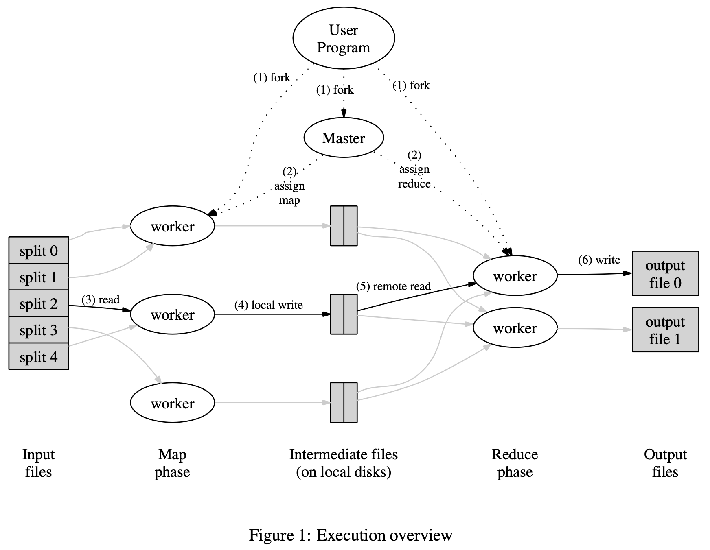

# 6824_lab1

# MIT6.824 Lab1
<https://pdos.csail.mit.edu/6.824/labs/lab-mr.html>
## MapReduce框架结构

- master负责分配任务（map or reduce）给worker进程
- map worker从input files读取一个shard并进行处理，然后存储中间结果，中间结果会根据partition
function分割成R个region.
- reduce worker从各个map worker处读取其负责的中间结果文件，**需要进行一个sort，因为
往往一个reduce task会负责多个不同的key，进行sort来把相同的key-value进行group， 然后
进行reduce操作并写入结果文件。

### 针对failure问题的解决方案：rename
- map和reduce worker均生成temp file。
- map worker完成后，生成R个中间temp 文件，并把文件名传给coordinator，若coordinator没收到过
该map task的，则记录下来，否则忽略。
- reduce worker则根据coordinator提供的文件名进行读取，结果也写入temp file，完成后进行rename，
因此多个相同的reduce worker也只会产生一个output file。（output file位于GFS上，不是local disk）

### 针对straggler问题：
当一个map-reduce快要完成时，coordinator同时开启一些backup进程来完成剩下的工作，不论是backup还是
primary先完成，整个job都完成了。

---
## Lab1
> 用go语言实现一个简单的MapReduce系统(coordinator + worker)，多个worker进程调用
application的Map和Reduce function，并负责中间文件和结果文件的读写。worker通过RPC
与coordinator交流，ask for task，coordinator负责分配task给worker，并处理work的failuer问题：
某个worker长时间还未完成时，把这个task给另一个worker。

### 大体思路
框架已经实现了worker通过rpc与coordinator交流。
- worker向coordinator发信息，请求新的任务
- coordinator根据当前的meta data，发送任务给worker
    - map任务：包括input， task_no, reduce task数目（用作中间结果命名, mr-X-Y）
    - reduce任务：包括task_no(任务编号), map task数目（用来读取所有中间结果对应partition）
- worker根据收到的回复，执行相应任务：map or reduce
- worker执行完成后通知coordinator，coordinator更新meta data
- coordinator发现job 完成后，再收到worker的请求的话，回复Done，worker收到后退出。

#### 处理straggler问题：
- coordinator维护一些task的meta data：task的开始时间
- coordinator发task流程：先发map，再发reduce，若都完成，发送``Done``
    - 遍历所有map任务，若存在map任务未完成：
        - 若该map任务未开始（start_stamp = 0）或者执行时间已经超过10s
            - 把该map task发给该请求worker
        - 否则，该任务正在执行（map未done），继续遍历
    - 若map未done，且所有map task都正常运行，告诉该worker等待
    - 若map已done，类似的便利reduce任务
- 若reduce已done，告诉worker ``Done``

